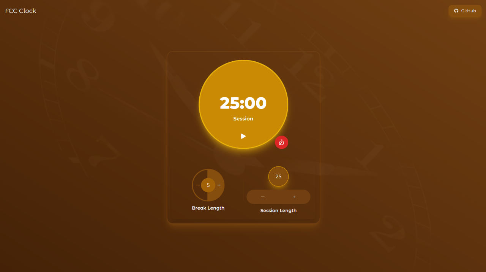

# FCC Clock

FCC Clock is a timer application that helps you manage your time effectively using customizable session and break lengths. Stay productive and organized with this interactive countdown timer.

## Table of Contents

- [Demo](#demo)
- [Features](#features)
- [Installation](#installation)
- [Usage](#usage)
- [Contributing](#contributing)
- [License](#license)

## Demo

Try out the FCC Clock here: [Live Demo](https://clock.ome9a.com)

## Features

- Customize session and break lengths according to your preference.
- Interactive user interface for easy time management.
- Utilize the Pomodoro technique to enhance productivity.
- Countdown timer displays remaining time in mm:ss format.
- Audio alert when the timer reaches zero.
- Pause and resume functionality for better control.

## Installation

1. Clone the repository: `git clone https://github.com/0me9a/fcc-clock`
2. Navigate to the project directory: `cd fcc-clock`
3. Install dependencies: `npm install`

## Usage

1. Start the development server: `npm run dev`
2. Open your browser and visit: `http://localhost:3000`

Customize session and break lengths using the increment and decrement buttons. Click the "Start/Pause" button to control the timer. Click the "Reset" button to reset the timer and lengths.

## Contributing

Contributions are welcome! Feel free to open issues and pull requests to suggest enhancements, report bugs, or propose new features.

## License

This project is licensed under the [MIT License](LICENSE).

---

Created with ❤️ by [Baliram Singh](https://ome9a.com)
